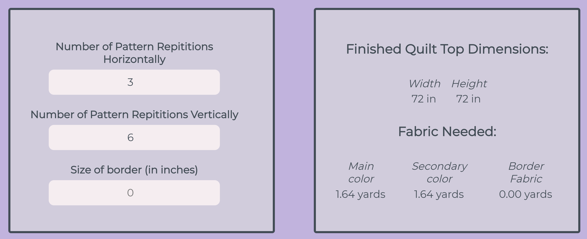
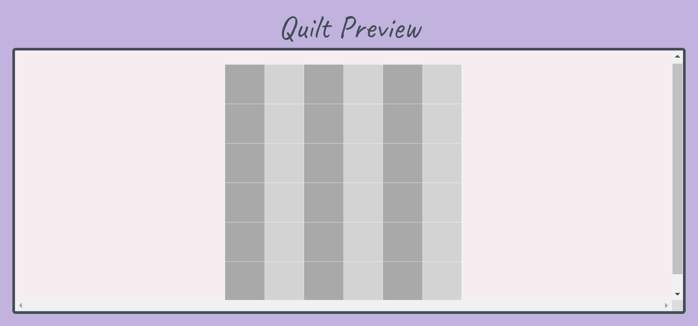

# Quilt Calc

## Summary
This app allows you to get real-time calculations of needed fabric for different quilt patterns. The user can choose from different classic quilt patterns and then change parameters such as length, width, and border sizes.

## Screenshots

Pannel for user customization of quilt pattern and resulting fabric calculations

Quilt preview that is updated in real-time to refelect user's choices

## Live Demo

https://quilt-calc.vreplicon.now.sh/

## Backend Repo

https://github.com/vreplicon/quilt-calc-api

## Technologies Used

### Front End

React

### Back End

Node.js, Express

### Testing

Chai, Supertest, Mocha
